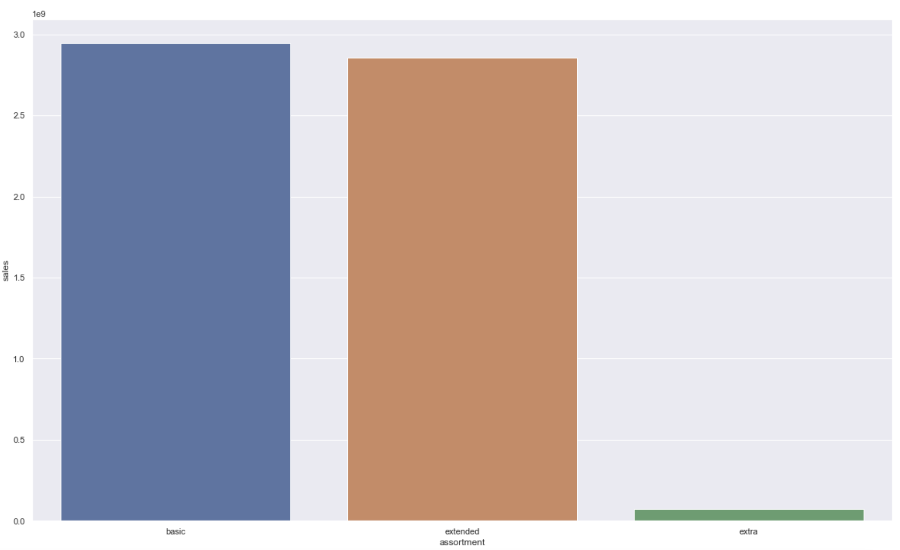
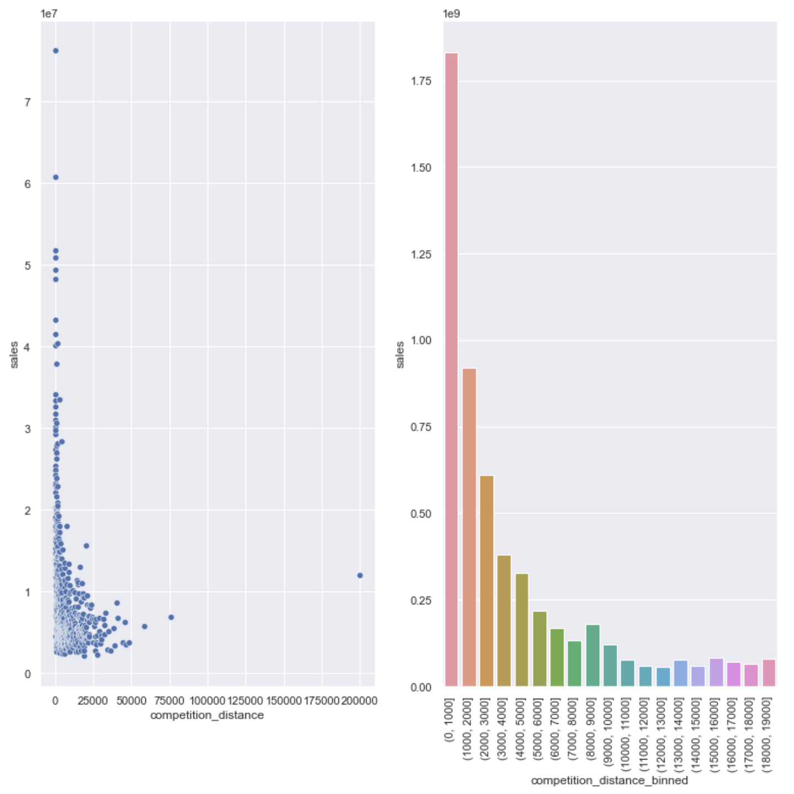
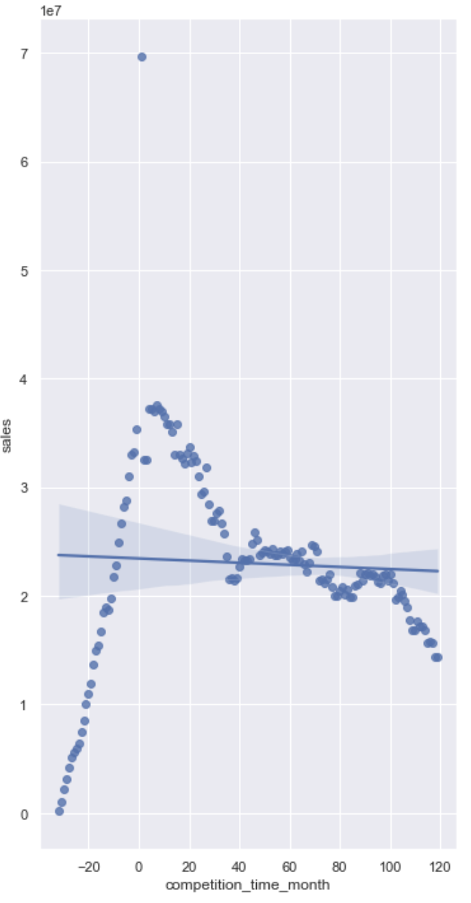
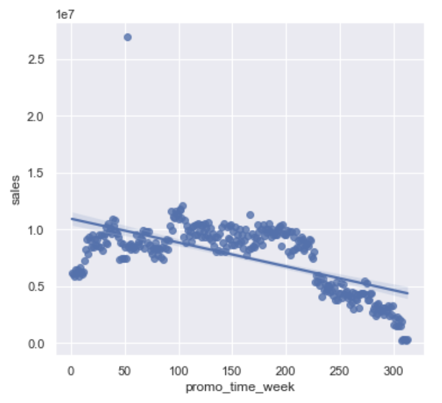
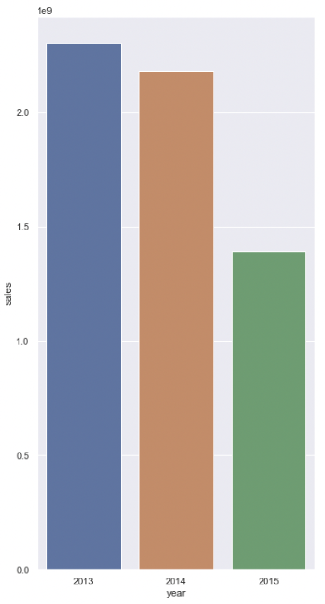
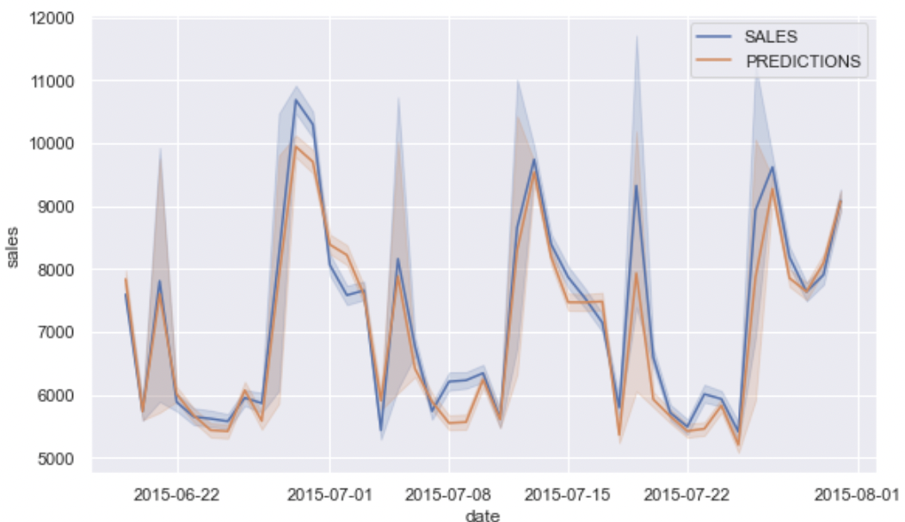

# **Sales forecasting  - Rossmann European drugstore case**

Sales forecsatin of type prediction project with a real drugstore stores sales problem with an [open data source ](https://www.kaggle.com/competitions/rossmann-store-sales/overview/description)

## **1. Business question**

### **1.1. About**
Rossmann operates 4088 drug stores in 7 European countries until 2019. Currently, Rossmann store managers are tasked with predicting their daily sales for up to six weeks in advance. Store sales are influenced by many factors, including promotions, competition, school and state holidays, seasonality, and locality. With thousands of individual managers predicting sales based on their unique circumstances, the accuracy of results can be quite varied.  
**[Source](https://www.statista.com/statistics/921492/top-personal-care-retailers-store-numbers/)**

- **Problem and necessity:** Need to invest in the stores remodeling. Thus, they must know the revenue in each store to allocate investments;
- **Motivation:** The sales forecast was requested by CFO in a monthly business results meeting;
- **Root cause:** Difficult to set the investment value to remodel each store;
- **Problem owner:** Rossmann drugstore Financial VP (CFO);
- **Format of the solution:**  
    Granularity: Sales forecasting per day at each store to next 42 days (6 weeks)  
    Problem type: Sales Forescasting  
    Potential methods: Time series  
    Delivery format:  
        a) Sales forecast at each store ending 6 weeks  
        b) How would these sales would daily happen
- **What do I have to solve (Business problem)?:** Sales forecast (in $) at each store over the next 6 weeks

## **2. Business assumptions**

- Index registered False on Open days weren't considered (closed days);
- Assuming zero or null sales values as closed stores, then these index won't be considered;
- Column **‘Customers’** weren't used because the target variable/dependent variable is sales;
- Data dictionary:    
&emsp;    **Id:** an Id that represents a (Store, Date) duple within the test set;    
&emsp;    **Store:** a unique Id for each store;    
&emsp;    **Sales:** the turnover for any given day (this is what you are predicting);    
&emsp;    **Customers:** the number of customers on a given day;    
&emsp;    **Open:** an indicator for whether the store was open: 0 = closed, 1 = open;    
&emsp;    **StateHoliday:** indicates a state holiday. Normally all stores, with few exceptions, are closed on state holidays. Note that all schools are closed on public holidays and weekends. a = public holiday, b = Easter holiday, c = Christmas, 0 = None;    
&emsp;    **SchoolHoliday:** indicates if the (Store, Date) was affected by the closure of public schools;    
&emsp;    **StoreType:** differentiates between 4 different store models: a, b, c, d;    
&emsp;    **Assortment:** describes an assortment level: a = basic, b = extra, c = extended;    
&emsp;    **CompetitionDistance:** distance in meters to the nearest competitor store;    
&emsp;    **CompetitionOpenSince[Month/Year]:** gives the approximate year and month of the time the nearest competitor was opened;    
&emsp;    **Promo:** indicates whether a store is running a promo on that day;    
&emsp;    **Promo2:** Promo2 is a continuing and consecutive promotion for some stores: 0 = store is not participating, 1 = store is participating;    
&emsp;    **Promo2Since[Year/Week]:** describes the year and calendar week when the store started participating in Promo2;    
&emsp;    **PromoInterval:** describes the consecutive intervals Promo2 is started, naming the months the promotion is started anew. E.g. "Feb,May,Aug,Nov" means each round starts in February, May, August, November of any given year for that store.

## **3. Planning solution**

1. **Project scope:**
    - Daily sells/sales ($) in next 6 weeks;
    - Hypothesis validation;
    - Prediction problem
    - Time Series, Regressão e Neural Networks
    - Sales prediction and automatic answer bot for cellphone(**Entrega da previsão de vendas com bot para respostas automáticas)**
2. **Tools:**
    1. Python;
    2. Jupyter Notebook;
    3. VSCode;
    4. Render cloud application.
3. **Process:**
    1. Raise business pains and needs together hypothesis to be validated
    2. Loading Data:
        1. Public data in **[Kaggle](https://www.kaggle.com/competitions/rossmann-store-sales/data)**
    3. Data cleaning and types transformation:
        1. Null values
        2. Data types
        3. Duplicates;
        4. Outliers;
    4. Feature Engineering;
    5. Filtering variables;
    6. EDA - Exploratory Data Analysis;
    7. Answering business problems and hypothesis;
    8. Data preparation/transformation;
    9. Feature Selection;
    10. Machine Learning Modeling;
    11. Hyperparameters Fine Tuning;
    12. Error translations and interpretations;
    13. Deloying model in cloud.
    
    
## **4. Mains insights**

- **Hypothesis 1. Stores with more stock should selll more  

FALSE** - BIGGEST ASSORTMENT stores sell LESS
- **Hypothesis  2. Near competition makes less sales  

FALSE** - In fact, stores with CLOSE COMPETITORS sell MORE  
- **Hypothesis  3. Stores with older competitors should sell more.  

FALSE** - Stores with OLDER COMPETITORS sell LESS.  
- **Hypothesis 4. Long time promotions should sell more  

FALSE** - The stores regularly sell up to a certain period, then it starts to decrease.  
- **Hypothesis  8. Stores should sell more passing the years  

FALSE** - Sales have been decresing over the years  

## **5. Financial results for the business**

The chosen algorith was xgboost due to performance vs execution time, so that, after cross-validation, a MAE (mean absolute error) of $638 and MAPE(mean absolute percentage error) of 9,2% were obtained

That is, during next 6 weeks, the predictive model has an mean error of +/-$634 (9,3%) by store each day.

Below is showed a daily comparison of average sales and average forecasts across the entire store chain:

Thus, assuming that company's forecast **so far were manual** with a mean error close to 30%, we have a gain of 20,8 percentile point. It means, if with forecast before ways we have needed an investment allocation of $10 millions, now we will need to allocate $8 millions investment.

These values show only original capital, without interest on capital over time. That is, will be able to save interest over $2 million.

## **6. Learnings and conclusion**

The main objective was reached with a sales forecast with about 10% error in a first project result delivery helping CFO to optimize Rossmann financial management and improve assertiveness in investment capital allocation.

## **7. Next steps**

1. Feature engineering working better predictive variables to improve model accuracy;
2. Design sales forecast and its errors in a dashboard within a DataViz software/app by period, store, leader or any other granularity requested by stakeholders to help then to allocate investment capital more efficiently.